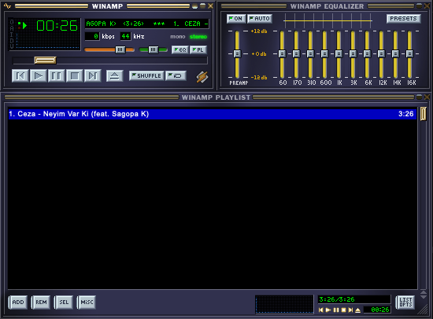

<p align="center">
  
</p>

<h1 align="center">Winampfy</h1>

<p align="center">
  macOS, Windows ve Linux için native, Winamp 2 görünümlü Spotify Premium oynatıcısı.
</p>

<p align="center">
  <a href="README.md">English</a>
  ·
  <a href="https://github.com/KiPSOFT/winampfy/releases/latest">İndir</a>
  ·
  <a href="https://github.com/KiPSOFT/winampfy/actions/workflows/release.yml">Derlemeler</a>
</p>

<p align="center">
  <a href="https://github.com/KiPSOFT/winampfy/actions/workflows/release.yml"></a>
  <a href="https://github.com/KiPSOFT/winampfy/releases/latest"></a>
</p>



Winampfy, Webamp'ın Winamp 2.x arayüzünü native Tauri kabuğu ve librespot üzerinden doğrudan Spotify oynatma ile birleştirir. Kimlik doğrulama tamamlandıktan sonra Spotify uygulamasının açık kalması gerekmez.

> [!IMPORTANT]
> Winampfy resmî olmayan, kişisel/deneysel bir istemcidir. Spotify veya Winamp ile bağlantılı ya da bu markalar tarafından onaylanmış değildir. Spotify Premium hesabı gerektirir. Kullanım sorumluluğu kullanıcıya aittir; ilgili hizmet koşullarını inceleyin.

## Özellikler

- Webamp ile gerçek Winamp 2.x pencereleri ve `.wsz` skin desteği
- Native, çerçevesiz ve sürüklenebilir macOS/Windows/Linux masaüstü penceresi
- librespot ile doğrudan Spotify ses oynatma
- Winamp stilindeki pencere içinde Spotify araması
- Arama sonuçlarından çoklu seçim ve sıralı playlist oynatma
- Ad/sahip filtresi ve doğrudan playlist URL desteğiyle Spotify playlist tarayıcısı
- **LIST OPTS → LOAD LIST** üzerinden mevcut listeyi değiştirme ve yüklemeden önce isteğe bağlı karıştırma
- Play, pause, önceki, sonraki, seek, ses, shuffle ve repeat kontrolleri
- Uygulama kapatılıp açıldığında korunan playlist
- Sistem tepsisine küçültme, tepsiden geri açma ve çıkış
- GitHub Releases üzerinden imzalı otomatik güncelleme
- 320 kbps oynatma ve yerel ses önbelleği

## İndirme

Kurulum dosyaları [GitHub Releases](https://github.com/KiPSOFT/winampfy/releases) sayfasına eklenir:

- **Apple Silicon macOS:** `aarch64` DMG dosyasını indirin
- **Intel macOS:** `x86_64` DMG dosyasını indirin
- **Windows x64:** NSIS `.exe` veya WiX `.msi` kurulumunu indirin
- **Arch Linux x64:** `.AppImage` dosyasını indirin, çalıştırılabilir yapın ve açın

Herkese açık derlemeler şu anda Apple notarization veya ticari kod imzalama sertifikası kullanmıyor. macOS'ta uygulamayı **Sistem Ayarları → Gizlilik ve Güvenlik** bölümünden onaylamanız gerekebilir. Windows SmartScreen de bilinmeyen yayıncı uyarısı gösterebilir.

## Kullanım

1. Winampfy'ı açıp **Play** düğmesine basın veya Playlist Editor'daki **ADD** düğmesini açın.
2. İstendiğinde sistem tarayıcısında Spotify OAuth girişini tamamlayın.
3. **ADD** üzerinden Spotify'da arama yapın, bir veya daha fazla şarkı seçip listeye ekleyin.
4. Spotify playlist'i yüklemek için **LIST OPTS → LOAD LIST** yolunu açın, tek playlist seçin, isterseniz **SHUFFLE BEFORE LOAD** seçeneğini etkinleştirip **LOAD** düğmesine basın.
5. Listeyi sırayla oynatmak için **Play** düğmesine basın.

Kimlik doğrulama tarayıcıda yapılır. Winampfy, erişim anahtarını localhost OAuth callback üzerinden alır; Spotify parolanızı istemez veya saklamaz.

## Geliştirme

### Gereksinimler

- Node.js 20 veya üzeri
- Güncel kararlı Rust (Rust 1.85 veya üzeri)
- [Tauri dokümantasyonundaki](https://v2.tauri.app/start/prerequisites/) platform gereksinimleri
  - macOS: Xcode Command Line Tools
  - Windows: Microsoft C++ Build Tools ve WebView2
  - Arch Linux: `webkit2gtk-4.1`, `libappindicator-gtk3`, `alsa-lib` ve Tauri gereksinimlerindeki diğer paketler

```sh
npm ci
npm run tauri dev
```

Kontrolleri çalıştırmak ve yerel paket oluşturmak için:

```sh
npm run build
cd src-tauri && cargo test && cd ..
npm run tauri -- build
```

## Release oluşturma

[Release workflow'u](.github/workflows/release.yml) dört hedefi paralel derler:

- Apple Silicon macOS (`aarch64-apple-darwin`)
- Intel macOS (`x86_64-apple-darwin`)
- Windows x64 (`x86_64-pc-windows-msvc`)
- Arch Linux uyumlu Linux x64 AppImage (`x86_64-unknown-linux-gnu`)

`package.json`, `src-tauri/Cargo.toml` ve `src-tauri/tauri.conf.json` içindeki sürümle eşleşen bir etiket gönderin:

```sh
git tag v0.1.0
git push origin v0.1.0
```

Workflow herkese açık bir GitHub Release oluşturur, derlenen kurulum dosyalarını ekler ve imzalı `latest.json` güncelleme manifestini yayınlar. Actions sekmesinden elle de başlatılabilir.

Otomatik güncellemeler için Tauri updater imza anahtarı gerekir. Özel anahtarı Git dışında tutun ve içeriğinin tamamını `TAURI_SIGNING_PRIVATE_KEY` repository secret'ı olarak ekleyin. Eşleşen public key `src-tauri/tauri.conf.json` içine gömülüdür. Özel anahtar kaybedilirse mevcut kurulumlara yeni güncelleme yayınlanamaz.

## Mimari

| Katman | Teknoloji | Sorumluluk |
| --- | --- | --- |
| Arayüz | TypeScript + Webamp | Winamp arayüzü, playlist ve kontroller |
| Masaüstü | Tauri 2 | Native pencere, sistem tepsisi ve IPC |
| Oynatma | Rust + librespot | OAuth, arama, Spotify Connect ve ses |

## Üçüncü taraf yazılımlar ve markalar

- [Webamp](https://github.com/captbaritone/webamp) — MIT; Winamp 2 arayüzü ve `.wsz` skin desteği
- [librespot](https://github.com/librespot-org/librespot) — MIT; resmî olmayan Spotify oynatma

Winamp logosu ve adları ilgili sahiplerinin korunan markaları olabilir. Atıflar ve diğer uyarılar için [THIRD_PARTY_NOTICES.md](THIRD_PARTY_NOTICES.md) dosyasına bakın.
